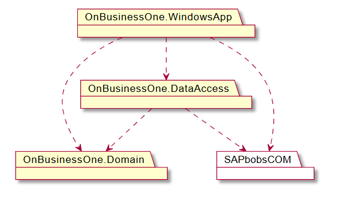
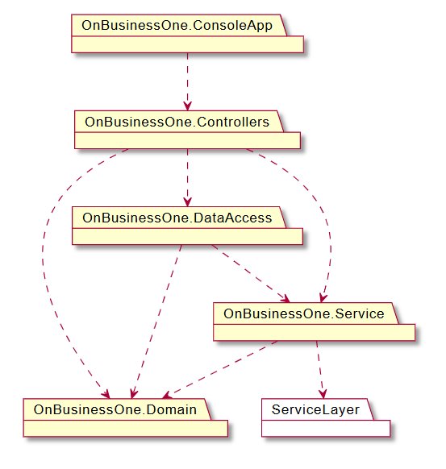

# OnBusinessOne

OnBusinessOne is a solution which integrates the SDK and Service Layer of SAP Business One into a desktop application and a console application.

## Desktop Application

OnBusinessOne.SDK.WindowsApp is a desktop application which allows you to register sales offers for a business partner with the items lines you need.
The information is recorded in the SAP database using the SDK and its recording objects.

### Architecture

## Console Application

OnBusinessOne.ServiceLayer.ConsoleApp is a console application that allows you to reverse accounting entries using a text file in .csv format containing 
the transaction identifiers (TransId) and SAP Business One service layer resources.

### Architecture

